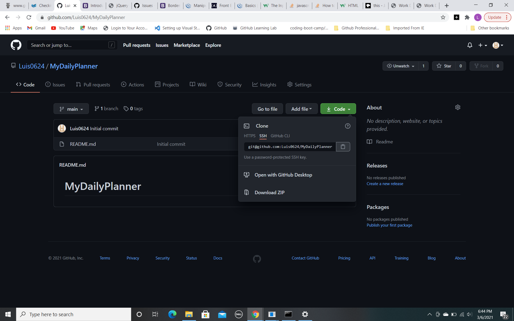
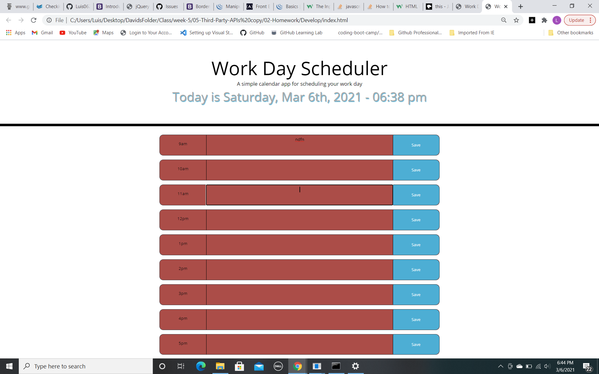

# MyDailyPlanner
First attempt at using Javascript to make a daily planner

    With this planner you are able to select specific time slots and scehdule tasks or events and save it to the browsers storage and it will remain even if the browser is refreshed. it will also highlight time slots based on if it in the past, present or future and changes based on the current time.

  ### Generator guidelines
  
  * Click anywhere in the slot or on the slot hr and it will take you into the text input area for that time slot.

  * Add whatever text you want to addto your daily planner and click on the save button,

  * the input text will be storaged on the browsers storage and it remain there until it is changed or cleared

  * The planner will currently check the time and let you know which time slot is the present, which are in the past and which are in the future,

  * Simply press the clear button on the bottom to clear the time slots

  
### INSTALLATION
Use the following gitHub link [My Daily Planner](https://github.com/Luis0624/MyDailyPlanner.git) to get to my github page and be able to clone the repo for my first daily planner.

Demo image for cloning github repo

[demo for cloning github repo](https://github.com/Luis0624/MyDailyPlanner.git)

[deployed Github pages link](https://luis0624.github.io/MyDailyPlanner/)

Sample image of deployed repo

After copying the ssh/https link open your terminal(MacOS) or Gitbash(Windows) and enter the command git clone "paste link here"
In your file finder open the folder that was created after cloning in the location you chose to clone the repo. Open the folder that was created with VS code(or any code editing program) and you should have the files and images that was used. 

### USAGE

Using VS code, or your choice of editor feel free to look through the HTML file,the CSS stylesheet and JS script. Contributions are welcome if they conform to the the following requirements:

* Refactoring suggestions can be made within comments above the code lines in question.
* Important: Use the Scout Rule, which recommends that you always leave the code a little cleaner than when you found it.
* If any code is changed please add a comment stating what was changed above the changed code.

### CREDITS

### LICENSE
  
